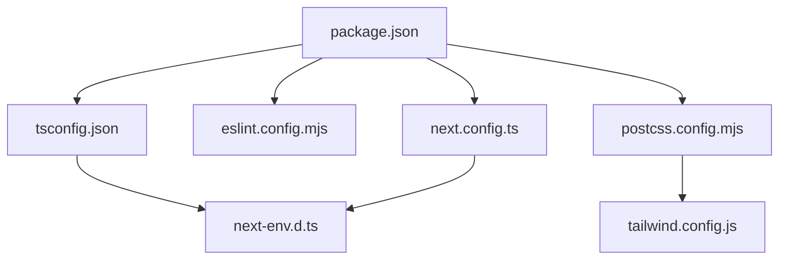

# プロジェクト設定ファイル詳細解説

## 概要
Next.js + TailwindCSS + TypeScriptプロジェクトの各設定ファイルの詳細な解説です。
各ファイルの役割、設定内容、相互関係について詳しく説明します。

## 📁 設定ファイル一覧

```
プロジェクトルート/
├── package.json           # 依存関係・スクリプト管理
├── package-lock.json      # 依存関係のロックファイル
├── tsconfig.json          # TypeScript設定
├── eslint.config.mjs      # ESLint設定
├── next.config.ts         # Next.js設定
├── next-env.d.ts          # Next.js型定義
└── postcss.config.mjs     # PostCSS設定
```

## 🔧 1. package.json - プロジェクトの心臓部

### 基本情報
```json
{
  "name": "site-home",
  "version": "0.1.0",
  "private": true
}
```

**詳細説明**:
- `name`: プロジェクト名（npmパッケージ名としても使用）
- `version`: セマンティックバージョニング（major.minor.patch）
- `private`: trueでnpmへの公開を防止（個人プロジェクトでは必須）

### 📍スクリプト設定

```json
{
  "scripts": {
    "dev": "next dev --turbopack",
    "build": "next build --turbopack",
    "start": "next start",
    "lint": "eslint"
  }
}
```

#### 📝`dev`: 開発サーバー

```bash
next dev --turbopack
```

* **Turbopack** は Next.js 15 から正式採用された新世代バンドラーであり、Webpack よりも数倍高速である。
* ファイル変更を即時反映する **ホットリロード（HMR）** 機能を持つ。
* デフォルトポートは **3000番**。変更する場合は `--port 3001` のように指定する。
* TypeScript 型検証や Lint チェックは行わず、開発中の迅速なビルドを優先する。

#### 📝`build`: 本番ビルド

```bash
next build --turbopack
```

* **最適化処理**（コード分割・ツリーシェイキング・圧縮）を行い、本番向けに静的ファイルを生成する。
* 出力は `.next` ディレクトリに保存される。
* TypeScript の型整合性チェックと ESLint による静的解析を自動実行し、ビルド時にエラーを検出する。
* Turbopack により、従来の Webpack よりも 2〜5 倍のビルド速度を実現している。

#### 📝`start`: 本番サーバー

```bash
next start
```

* `npm run build` によって生成された最終成果物を起動する。
* サーバーモードで `.next` ディレクトリ内のビルド済み資産を提供する。
* 本番運用環境（例：Vercel・Cloud Run・Docker）での動作確認やパフォーマンステストに使用する。
* キャッシュ機構とミドルウェア最適化が有効化され、開発サーバーより高速に動作する。

#### 📝`lint`: コード品質チェック

```bash
eslint
```

* プロジェクト全体（`src/`, `app/`, `components/` 等）の TypeScript / JSX ファイルを対象に解析を行う。
* 文法誤り、スタイル違反、潜在的バグ、未使用変数などを検出する。
* `eslint.config.js` に基づき、Next.js 固有ルール（`eslint-config-next`）が適用される。
* CI/CD で自動実行することで、品質劣化を未然に防ぐ。


### 📍依存関係

### バージョン戦略

* **完全固定バージョン管理**（`^` や `~` を付けない）により、依存関係の再現性を確保している。
* チーム・デプロイ環境・CI間で動作の差異を防止し、ビルド再現性（Reproducible Build）を維持する。
* 依存の更新は明示的に `npm install react@19.1.1` のように行う運用を前提とする。

```json
{
  "dependencies": {
    "react": "19.1.0",
    "react-dom": "19.1.0",
    "next": "15.5.6"
  }
}
```

#### 📝React 19.1.0

* 最新安定版であり、**Concurrent Features**（同時レンダリング機構）と **React Compiler**（実験的最適化）を備える。
* `use` フック、`Server Components`、`Action API` など Next.js 15 の機能を支える基盤である。
* `useEffect` や `useState` の挙動は後方互換性を保ちつつ、非同期レンダリング最適化が進んでいる。

#### 📝React DOM 19.1.0

* React のレンダリングをブラウザ DOM に適用するモジュールであり、React 19 と組み合わせて動作する。
* Streaming SSR（サーバーストリーミング）や部分的Hydrationをサポートし、初期表示速度を改善する。
* クライアントとサーバーの境界を Next.js の App Router と統合的に管理する。

#### 📝Next.js 15.5.6

* App Router と Turbopack が正式統合された最新版である。
* ページ構成を `app/` ディレクトリ単位で管理し、**Server Components** を標準化している。
* Turbopack によってビルドと開発サーバーの両方を Rust ベースで高速化。
* TypeScript 5 と ESLint 9 に完全対応しており、設定衝突を最小限に抑える。


### 📍開発依存関係

```json
{
  "devDependencies": {
    "typescript": "^5",
    "@types/node": "^20",
    "@types/react": "^19",
    "@types/react-dom": "^19",
    "@tailwindcss/postcss": "^4",
    "tailwindcss": "^4",
    "eslint": "^9",
    "eslint-config-next": "15.5.6",
    "@eslint/eslintrc": "^3"
  }
}
```


#### 📝TypeScript 5

* JavaScriptに静的型付けを導入するためのコンパイラ兼型システムである。
* 本バージョンでは、**ECMAScript Decoratorsの正式仕様**に対応し、React・Next.jsとの親和性が向上している。
* `satisfies` 演算子により、型の互換性を明示しつつ値を保持することができ、設定オブジェクトの型安全性を高められる。
* **const型引数（const type parameters）** の導入により、ジェネリクス内でリテラル型を保持したまま処理できる。
* Next.js 15では `tsconfig.json` の型整合性チェックがビルド工程に統合されており、`next build` 実行時にも型検証が行われる。
* ESLintと連携することで、型エラーをLintエラーとして検出でき、CI/CDパイプラインに組み込みやすい。


#### 📝@types/node 20

* Node.js の型定義ファイルであり、TypeScript から Node.js 標準APIを型安全に扱うために必要である。
* バージョン 20 系は Node.js LTS（v20.x）に対応しており、最新のモジュール解決ロジック・`fetch` API なども含む。
* `fs`, `path`, `process` などを補完付きで使用できるため、Next.js の `server` コンポーネントや API ルートの記述に必須である。


#### 📝@types/react 19 / @types/react-dom 19

* ReactおよびReact DOMの公式型定義パッケージであり、JSX構文やコンポーネントのprops型チェックを可能にする。
* React 19（実験版を含む）に対応し、`use`, `ref as prop`, `Server Actions` などの新APIの型定義を先行サポートしている。
* `@types/react-dom` はDOM操作API（`createPortal`, `flushSync` など）を含み、SSRやStreaming Rendering時の型整合性を保証する。


#### 📝TailwindCSS 4

* CSSフレームワークの最新版であり、**Rust製のOxideエンジン**によりビルド性能が大幅に向上している。
* CSS変数を基盤としたテーマ管理が導入され、**デザイントークン**を型安全に扱うことが可能。
* PostCSS統合が簡素化され、`@tailwindcss/postcss` が正式なブリッジモジュールとなった。
* 設定ファイル (`tailwind.config.ts`) にTypeScriptが標準対応し、設定値やtheme拡張の補完が効く。
* プロジェクト規模が大きくなるほど設定の整合性が重要になるため、型安全な設定管理は有効である。


#### 📝@tailwindcss/postcss 4

* TailwindCSS 4の新ビルド基盤をPostCSS経由で利用するための公式プラグインである。

* `postcss.config.js` に`"@tailwindcss/postcss": {},`のように記載することで、Tailwindのカスタム処理を自動注入できる。

* Tailwind v4以降では `tailwindcss` 単体ではPostCSSを直接扱わず、**このモジュールを経由することが推奨**されている。

* ビルドチェーン（Vite, Next.js, Turbopack）との互換性を保つために必須の依存である。


#### 📝ESLint 9

* 静的解析ツールの最新版であり、**フラット設定（Flat Config）**方式が正式採用された。
* 旧式の `.eslintrc` は廃止され、`eslint.config.js` または `eslint.config.mjs` に設定を集約する。
* `eslint:recommended` や `plugin:@typescript-eslint/recommended` などの構成を関数的に統合できるようになり、設定の再利用性が高まった。
* Node.js環境やReact環境のESM対応を強化し、Next.jsとの連携時にバンドラの挙動を正確に反映できる。
* Lint対象をワークスペース全体（`src`, `app`, `components` など）に統合管理できる点が特徴である。


#### 📝eslint-config-next 15.5.6

* Next.js公式のESLint設定パッケージであり、Next.js 15系に最適化されている。
* 内部で `eslint-plugin-next` を統合し、以下のチェックを自動適用する：

  * 不正な `<Image>` / `<Link>` の使用
  * 非推奨API (`getStaticProps` など) の検出
  * Server / Client コンポーネントの混在防止
  * React 19構文（`use` フックなど）への対応
* プロジェクトのルートで `next lint` を実行するだけで設定が反映される。
* TypeScript, TailwindCSS, Reactとの整合性を確保するため、バージョン整合を厳密に保つ必要がある。


#### 📝@eslint/eslintrc 3

* 旧 `.eslintrc` 形式との**互換層モジュール**であり、既存のプラグインが新設定（Flat Config）に対応していない場合に必要となる。
* ESLint 9環境で古い `.eslintrc.json` や `.eslintrc.js` の設定をロードする際に内部的に使用される。
* 段階的移行（Partial Migration）を行うプロジェクトでは残すことが多いが、完全移行後は削除可能である。
* フラット設定に完全対応したプラグインへ移行が完了した段階で、依存から外すのが望ましい。


## 📋 2. tsconfig.json - TypeScript設定

### コンパイラオプション
```json
{
  "compilerOptions": {
    "target": "ES2017",
    "lib": ["dom", "dom.iterable", "esnext"],
    "allowJs": true,
    "skipLibCheck": true,
    "strict": true,
    "noEmit": true
  }
}
```

**詳細解説**:

#### `target: "ES2017"`
- **対象**: ES2017（ES8）仕様にコンパイル
- **機能**: async/await、Object.entries、String.padStart等
- **互換性**: モダンブラウザ対応（IE11非対応）

#### `lib: ["dom", "dom.iterable", "esnext"]`
- **dom**: ブラウザAPI（window、document等）
- **dom.iterable**: for...ofでDOMコレクション操作
- **esnext**: 最新ECMAScript機能

#### `strict: true`
- **効果**: 厳密な型チェック有効化
- **含まれる設定**:
  - `noImplicitAny`: 暗黙的any禁止
  - `strictNullChecks`: null/undefined厳密チェック
  - `strictFunctionTypes`: 関数型の厳密チェック

#### `noEmit: true`
- **理由**: Next.jsがコンパイルを担当
- **効果**: TypeScriptは型チェックのみ実行

### モジュール設定
```json
{
  "module": "esnext",
  "moduleResolution": "bundler",
  "resolveJsonModule": true,
  "isolatedModules": true
}
```

**詳細説明**:
- **bundler**: Turbopack/Webpack用の解決戦略
- **isolatedModules**: 各ファイルを独立してコンパイル可能
- **resolveJsonModule**: JSONファイルのimport許可

### Next.js統合設定
```json
{
  "jsx": "preserve",
  "incremental": true,
  "plugins": [{"name": "next"}]
}
```

**特徴**:
- **preserve**: JSXをそのまま保持（Next.jsが変換）
- **incremental**: 増分コンパイルで高速化
- **next plugin**: Next.js専用の型支援

### パスマッピング
```json
{
  "paths": {
    "@/*": ["./src/*"]
  }
}
```

**効果**:
```typescript
// 従来
import Header from '../../../components/Header';

// パスマッピング後
import Header from '@/components/Header';
```

## 🔍 3. eslint.config.mjs - ESLint設定

### フラット設定形式
```javascript
import { dirname } from "path";
import { fileURLToPath } from "url";
import { FlatCompat } from "@eslint/eslintrc";
```

**ESLint 9の新機能**:
- **フラット設定**: 従来の`.eslintrc.*`から移行
- **ES Modules**: `.mjs`拡張子でモジュール形式
- **後方互換**: `FlatCompat`で既存設定を利用

### 設定の継承
```javascript
const eslintConfig = [
  ...compat.extends("next/core-web-vitals", "next/typescript")
];
```

**継承内容**:
- **next/core-web-vitals**: パフォーマンス・アクセシビリティルール
- **next/typescript**: TypeScript特有のルール

### 除外設定
```javascript
{
  ignores: [
    "node_modules/**",
    ".next/**",
    "out/**",
    "build/**",
    "next-env.d.ts"
  ]
}
```

**除外理由**:
- **node_modules**: 外部ライブラリ
- **.next**: Next.jsビルド出力
- **next-env.d.ts**: 自動生成ファイル

## ⚙️ 4. next.config.ts - Next.js設定

### 基本構造
```typescript
import type { NextConfig } from "next";

const nextConfig: NextConfig = {
  /* config options here */
};

export default nextConfig;
```

**現在の状態**: 最小構成（デフォルト設定を使用）

### 拡張可能な設定例
```typescript
const nextConfig: NextConfig = {
  // 実験的機能
  experimental: {
    turbo: {
      rules: {
        '*.svg': {
          loaders: ['@svgr/webpack'],
          as: '*.js',
        },
      },
    },
  },

  // 画像最適化
  images: {
    domains: ['example.com'],
    formats: ['image/webp', 'image/avif'],
  },

  // 環境変数
  env: {
    CUSTOM_KEY: process.env.CUSTOM_KEY,
  },

  // リダイレクト
  async redirects() {
    return [
      {
        source: '/old-page',
        destination: '/new-page',
        permanent: true,
      },
    ];
  },
};
```

## 📄 5. next-env.d.ts - Next.js型定義

### 自動生成ファイル
```typescript
/// <reference types="next" />
/// <reference types="next/image-types/global" />
/// <reference path="./.next/types/routes.d.ts" />
```

**重要事項**:
- **編集禁止**: Next.jsが自動生成・更新
- **型サポート**: Next.js専用の型定義を提供
- **ルート型**: App Routerのルート情報を含む

### 提供される型
- `NextPage`: ページコンポーネント型
- `GetStaticProps`: 静的生成関数型
- `NextApiRequest/Response`: API Routes型
- `ImageProps`: Next/Image型

## 🎨 6. postcss.config.mjs - PostCSS設定

### TailwindCSS統合
```javascript
const config = {
  plugins: ["@tailwindcss/postcss"],
};
```

**TailwindCSS v4の特徴**:
- **統合型プラグイン**: 単一プラグインで完結
- **自動最適化**: 未使用スタイルの自動削除
- **CSS変数**: ネイティブCSS変数との統合

### 従来版との比較
```javascript
// TailwindCSS v3（従来）
module.exports = {
  plugins: {
    tailwindcss: {},
    autoprefixer: {},
  },
};

// TailwindCSS v4（現在）
const config = {
  plugins: ["@tailwindcss/postcss"],
};
```

## 🔗 設定ファイル間の相互関係

### 依存関係マップ


### 実行フロー
```bash
# 開発時
npm run dev
├── next.config.ts読み込み
├── tsconfig.json型チェック
├── postcss.config.mjs CSS処理
└── eslint.config.mjs（VS Code）

# ビルド時
npm run build
├── next.config.ts
├── tsconfig.json
├── eslint.config.mjs
└── postcss.config.mjs
```

## 🚀 最適化と今後の拡張

### パフォーマンス最適化
```typescript
// next.config.ts 拡張例
const nextConfig: NextConfig = {
  compress: true,
  poweredByHeader: false,

  webpack: (config, { isServer }) => {
    if (!isServer) {
      config.resolve.fallback.fs = false;
    }
    return config;
  },
};
```

### セキュリティ強化
```typescript
const nextConfig: NextConfig = {
  headers: async () => [
    {
      source: '/(.*)',
      headers: [
        {
          key: 'X-Content-Type-Options',
          value: 'nosniff',
        },
        {
          key: 'X-Frame-Options',
          value: 'DENY',
        },
      ],
    },
  ],
};
```

## 📊 設定の検証方法

### 1. TypeScript設定
```bash
# 型チェック
npx tsc --noEmit

# 設定確認
npx tsc --showConfig
```

### 2. ESLint設定
```bash
# ルール確認
npx eslint --print-config src/app/page.tsx

# 設定テスト
npm run lint
```

### 3. Next.js設定
```bash
# ビルド情報確認
npm run build

# 設定ダンプ
npx next info
```

## ⚠️ トラブルシューティング

### よくある問題

#### 1. パスマッピングが効かない
```json
// tsconfig.json確認
{
  "compilerOptions": {
    "baseUrl": ".",
    "paths": {
      "@/*": ["./src/*"]
    }
  }
}
```

#### 2. ESLintエラーが表示されない
```bash
# VS Code設定確認
.vscode/settings.json
{
  "eslint.validate": ["typescript", "typescriptreact"]
}
```

#### 3. TailwindCSSが効かない
```bash
# PostCSS設定確認
postcss.config.mjs

# 設定ファイル存在確認
ls tailwind.config.js
```

## 📈 設定品質スコア

### 現在の設定評価
```yaml
TypeScript設定: ✅ 優秀
- 厳密型チェック有効
- 最新機能活用
- Next.js完全統合

ESLint設定: ✅ 良好
- Next.js公式ルール
- TypeScript対応
- フラット設定採用

Next.js設定: ⚠️ 基本
- デフォルト設定のみ
- 拡張余地あり

PostCSS設定: ✅ 最新
- TailwindCSS v4
- 自動最適化
```

---

**作成日**: 2025年10月17日
**プロジェクト**: site-home
**設定バージョン**: Next.js 15.5.6, TailwindCSS v4, TypeScript 5
**対象環境**: 開発・本番共通
