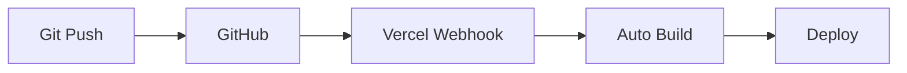

# Vercel デプロイ手順

## 概要
Next.js + TailwindCSS + TypeScriptプロジェクトをVercelにデプロイする手順を説明します。
Vercelは Next.js の開発元が提供するプラットフォームで、最適化された環境でデプロイできます。

## 前提条件

### ✅ 必要な準備
- [x] GitHubアカウント
- [x] Vercelアカウント（GitHubアカウントで登録可能）
- [x] プロジェクトがGitHubリポジトリにプッシュ済み
- [x] Next.js プロジェクトが正常にビルドできる状態

### 📋 現在のプロジェクト状況
```
プロジェクト名: site-home
フレームワーク: Next.js 15.5.6
スタイリング: TailwindCSS v4
言語: TypeScript
パッケージマネージャー: npm
```

## Step 1: プロジェクトの最終確認

### 1-1. ローカルでのビルドテスト

```bash
# 依存関係のインストール確認
npm install

# プロダクションビルド
npm run build

# ビルド成功確認
npm run start
```

**期待される結果**: エラーなくビルドが完了し、`http://localhost:3000` でサイトが表示される

### 1-2. package.json の確認

```json
{
  "scripts": {
    "dev": "next dev --turbopack",
    "build": "next build",
    "start": "next start",
    "lint": "next lint"
  }
}
```

**重要**: `build` と `start` スクリプトが存在することを確認

### 1-3. 環境変数の整理

```bash
# 本番環境で必要な環境変数をリストアップ
echo "現在の.env*ファイル:"
ls -la .env*
```

**注意**: `.env*` ファイルは`.gitignore`で除外されているため、Vercel側で設定が必要

## Step 2: GitHubリポジトリの準備

### 2-1. リポジトリの作成・プッシュ

```bash
# リモートリポジトリの確認
git remote -v

# まだリモートリポジトリがない場合
git remote add origin https://github.com/[USERNAME]/site-home.git

# 最新の変更をプッシュ
git add .
git commit -m "feat: ready for vercel deployment

- Complete basic portfolio components
- Update .gitignore for production
- Add vercel deployment documentation"

git push -u origin main
```

### 2-2. リポジトリの公開設定

- **Public**: 無料プランでも制限なし
- **Private**: Hobbyプランでは制限あり（Pro以上推奨）

## Step 3: Vercelアカウントの設定

### 3-1. Vercelアカウント作成

1. [vercel.com](https://vercel.com/) にアクセス
2. 「Continue with GitHub」でログイン
3. GitHubアカウントとの連携を承認

### 3-2. 料金プランの確認

```
Hobby Plan (無料):
- 帯域幅: 100GB/月
- ビルド時間: 6,000分/月
- プロジェクト数: 無制限
- カスタムドメイン: 対応
```

## Step 4: プロジェクトのデプロイ

### 4-1. New Project の作成

1. Vercel ダッシュボードで「New Project」をクリック
2. GitHubリポジトリから `site-home` を選択
3. 「Import」をクリック

### 4-2. プロジェクト設定

**Framework Preset**: Next.js（自動検出される）
**Root Directory**: `./`（デフォルト）
**Build Command**: `npm run build`（自動設定）
**Output Directory**: `.next`（自動設定）
**Install Command**: `npm install`（自動設定）

### 4-3. 環境変数の設定（必要に応じて）

```bash
# 環境変数が必要な場合の設定例
NEXT_PUBLIC_SITE_URL=https://your-site.vercel.app
NEXT_PUBLIC_GA_ID=G-XXXXXXXXXX
```

**設定場所**: Project Settings > Environment Variables

### 4-4. デプロイの実行

1. 「Deploy」ボタンをクリック
2. ビルドプロセスの開始を確認
3. デプロイ完了まで待機（通常1-3分）

## Step 5: デプロイ後の確認

### 5-1. デプロイ状況の確認

```bash
# デプロイ後に表示されるURL例
https://site-home-[random-string].vercel.app
```

### 5-2. 機能テスト

- [ ] ページの正常表示
- [ ] レスポンシブデザインの動作
- [ ] 全セクション（Hero, Skills, Projects, Contact）の表示
- [ ] フォームの動作（基本バリデーション）
- [ ] CSS・スタイリングの適用

### 5-3. パフォーマンス確認

```bash
# Lighthouse スコアの確認
- Performance: 90+
- Accessibility: 95+
- Best Practices: 95+
- SEO: 90+
```

## Step 6: カスタムドメインの設定（オプション）

### 6-1. ドメインの準備

```bash
# 独自ドメインを使用する場合
example.com
www.example.com
```

### 6-2. DNS設定

```
タイプ: CNAME
名前: www
値: cname.vercel-dns.com

タイプ: A
名前: @
値: 76.76.19.61
```

### 6-3. Vercelでのドメイン追加

1. Project Settings > Domains
2. 「Add Domain」でドメイン入力
3. DNS設定の確認
4. SSL証明書の自動発行確認

## Step 7: 継続的デプロイの設定

### 7-1. 自動デプロイの仕組み



### 7-2. ブランチ別デプロイ設定

```bash
# プロダクション: main ブランチ
main → https://site-home.vercel.app

# プレビュー: 他のブランチ
feature/new-design → https://site-home-git-feature-new-design-[username].vercel.app
```

## Step 8: 本番環境最適化

### 8-1. Next.js設定の最適化

```javascript
// next.config.js
/** @type {import('next').NextConfig} */
const nextConfig = {
  // 画像最適化
  images: {
    domains: ['example.com'],
    formats: ['image/webp', 'image/avif'],
  },

  // 実験的機能
  experimental: {
    optimizeCss: true,
  },

  // PWA対応（将来）
  // ...
};

module.exports = nextConfig;
```

### 8-2. メタデータの最適化

```typescript
// src/app/layout.tsx
export const metadata: Metadata = {
  title: "高梨のポートフォリオ | Web Developer",
  description: "フロントエンド開発者 高梨の個人ポートフォリオサイト。React、Next.js、TypeScriptを使用した開発実績を紹介。",
  keywords: ["Web Developer", "React", "Next.js", "TypeScript", "Portfolio"],
  authors: [{ name: "Takanashi" }],
  openGraph: {
    title: "高梨のポートフォリオ | Web Developer",
    description: "フロントエンド開発者のポートフォリオサイト",
    url: "https://site-home.vercel.app",
    siteName: "Takanashi Portfolio",
    locale: "ja_JP",
    type: "website",
  },
  twitter: {
    card: "summary_large_image",
    site: "@your_twitter",
    creator: "@your_twitter",
  },
};
```

## トラブルシューティング

### 🚨 よくある問題と解決策

#### ビルドエラー

```bash
# 型エラーの場合
npm run lint
npx tsc --noEmit

# 依存関係の問題
rm -rf node_modules package-lock.json
npm install
```

#### CSS が反映されない

```bash
# TailwindCSS設定確認
npx tailwindcss -i ./src/app/globals.css -o ./dist/output.css --watch

# purge設定確認（tailwind.config.js）
content: [
  "./src/**/*.{js,ts,jsx,tsx,mdx}",
]
```

#### 環境変数が読み込まれない

```bash
# NEXT_PUBLIC_ プレフィックスの確認
NEXT_PUBLIC_API_URL=https://api.example.com

# Vercel環境変数設定確認
Project Settings > Environment Variables
```

## デプロイ完了チェックリスト

### ✅ 最終確認項目

- [ ] サイトが正常に表示される
- [ ] 全セクションが機能している
- [ ] レスポンシブデザインが動作している
- [ ] メタデータが適切に設定されている
- [ ] パフォーマンススコアが良好
- [ ] HTTPSが有効になっている
- [ ] 自動デプロイが機能している

## 今後の運用

### 📊 モニタリング

```bash
# Vercel Analytics（有料）
- ページビュー数
- ユニークユーザー数
- パフォーマンス指標

# Google Analytics（無料）
- 詳細なユーザー行動分析
```

### 🔄 継続的改善

1. **A/Bテスト**: Vercel の機能を活用
2. **パフォーマンス監視**: Core Web Vitals
3. **SEO最適化**: 検索ランキング向上
4. **ユーザビリティ改善**: フィードバック反映

---

**作成日**: 2025年10月17日
**対象プロジェクト**: site-home
**Vercel料金プラン**: Hobby (無料)
**推定デプロイ時間**: 10-15分

## 参考リンク

- [Vercel公式ドキュメント](https://vercel.com/docs)
- [Next.jsデプロイメントガイド](https://nextjs.org/docs/deployment)
- [TailwindCSS本番環境設定](https://tailwindcss.com/docs/optimizing-for-production)
